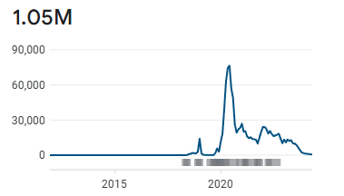

# WhatsApp Video Statuses

  

## Description
**WhatsApp Video Statuses** is a  simple and user-friendly Android app designed for watching and downloading short videos for profile stories. The videos are categorized under various themes such as love, comedy, wisdom, Islamic, and more, allowing users to easily find the content that interests them. With a single click, users can download or share videos directly from the app. Developed in 2019, the app has seen significant success and user engagement.

## Features
- **Categorized Videos**: Browse through various categories like love, comedy, wisdom, Islamic, and more.
- **Paginated Videos with Infinite Scroll**: Enjoy a seamless browsing experience with paginated videos and infinite scroll functionality.
- **Sorting Options**: Sort videos by different criteria such as most likes, most watched, or by date.
- **One-Click Download**: Download your favorite videos with just one click.
- **Easy Sharing**: Share videos directly to WhatsApp or other social media platforms with ease.
- **User-Friendly Interface**: Simple and intuitive design for seamless user experience.
- **Firebase Push Notifications**: Receive updates and notifications via Firebase.
- **Google Ads Integration**: Supports Google Ads for monetization.

## Google Play Story
**WhatsApp Video Statuses** was published on the Google Play Store in 2019. Since its release, it has achieved remarkable success:
- **1 Million Downloads**: The app has been downloaded over 1,000,000 times.
- **$20k  Profit from Ads**: Generated $20,000 in profit through Google Ads integration.

This success is a testament to the app's quality and the value it provides to users.

## App Screenshots

<table align="center">
  <tr>
    <td colspan="4" >

</td>
  </tr>
  <tr>
    <td></td>
    <td></td>
    <td></td>
    <td></td>
  </tr>
</table>
